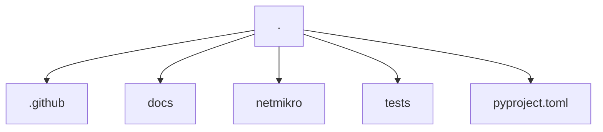
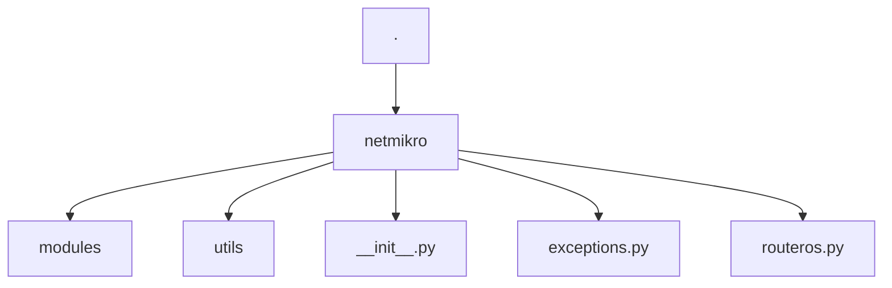
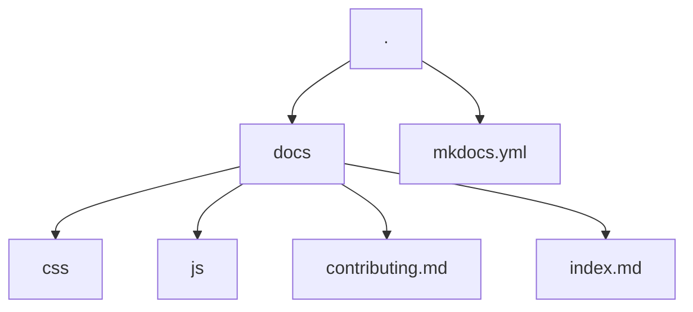
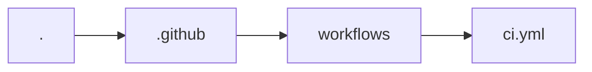

# Contributing to the project

Thank you very much for wanting to contribute to the project! To contribute, you can open an issue or a pull request. If you want to contribute code, I recommend that you read this document to understand how the project is organized and how to contribute.

## How is the project organized?

**Directory structure**



The project is divided into three main directories:

- `netmikro`: Contains the source code of the project.
- `tests`: Contains the tests of the project.
- `docs`: Contains the documentation of the project.

### netmikro



All project source code is in the `netmikro` directory. Whenever relevant, the documentation for each module, class or function will be done in the code itself, following the [google docstrings](https://sphinxcontrib-napoleon.readthedocs.io/en/latest/example_google.html) standard. So, if you change anything in the code, remember to also update the docstrings (if they exist).

### Tests

For testing we are using [pytest](https://docs.pytest.org/). Its settings can be found in the [pyproject.toml](pyproject.toml) file in the root of our project.

Test coverage is being generated automatically with [pytest-cov](https://github.com/pytest-dev/pytest-cov), being displayed when the test task is executed:

```bash
task test
```

Whenever you run `task test`, three tasks are performed:

- `pre_test`: Runs `task lint` to check if the code is following the project style standard.
- `test`: Runs the tests.
- `post_test`: Generates the coverage report.

Each of these tasks are explained in detail in the [Tasks](#tasks) section.

### Documentation

The project's documentation is generated with [MkDocs](https://www.mkdocs.org/), with the theme [Material for MkDocs](https://squidfunk.github.io/mkdocs-material/) and hosted on [Read the Docs](https://readthedocs.org/). The documentation is written in Markdown and is in the `docs` directory.



All configuration can be found in the [mkdocs.yml](https://github.com/henriquesebastiao/netmikro/blob/main/mkdocs.yml) file in the root of the repository.

### Tools

This project basically uses two tools as a basis for everything with control:

- [Poetry](https://python-poetry.org/): For environment management and library installation;
- [Taskipy](https://github.com/illBeRoy/taskipy): For automation of routine tasks. How to run tests, linters, etc.

Ensure you have Poetry installed and properly configured on your machine.

### Tasks

Listed here are the project's task settings, which you can use to perform common tasks. How to run tests, linters, etc.

To run a task, use the following command:

```bash
task <nome_da_task>
```

```toml
[tool.taskipy.tasks]
ruff = "ruff check ."
blue = "blue --check . --diff"
isort = "isort --check --diff ."
mypy = "mypy -p netmikro"
radon = "radon cc ./netmikro -a -na"
bandit = "bandit -r ./netmikro"
pydocstyle = "pydocstyle ./netmikro --count --convention=google --add-ignore=D100,D104,D105,D107"
lint = "task ruff && task blue && task isort"
format = 'blue .  && isort .'
docs = "mkdocs serve"
quality = "task mypy && task radon && task pydocstyle"
badge = "coverage-badge -o docs/assets/coverage.svg -f"
pre_test = "task lint"
test = "pytest -s -x --cov=netmikro -vv"
post_test = "coverage html"
export-requirements = "rm requirements.txt && poetry export -f requirements.txt --output requirements.txt --without-hashes"
export-requirements-doc = "poetry export -f requirements.txt --output docs/requirements.txt --without-hashes --only doc"
ready = "task lint && task quality && task bandit && pytest -s -x --cov=netmikro -vv && coverage html && task export-requirements && task export-requirements-doc && task badge"
```

#### .github



The `.github` directory contains the GitHub Actions configuration files. The `ci.yml` file contains the project's CI/CD settings. With it, whenever a commit is made to the `main` branch, GitHub Actions will run tests and linters checking if everything is OK.

### A recommendation

To make commits easier to read, it is recommended to follow the [Conventional Commits](https://www.conventionalcommits.org/en/v1.0.0/) commit message pattern of semantic commits.